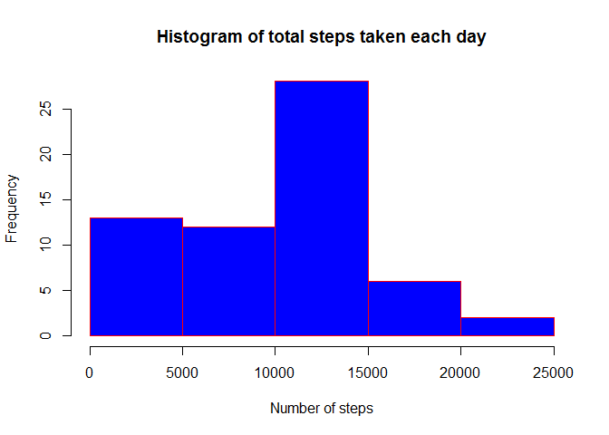
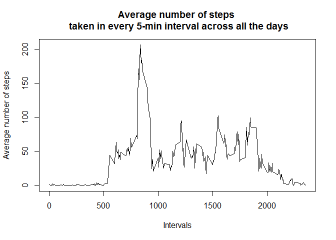
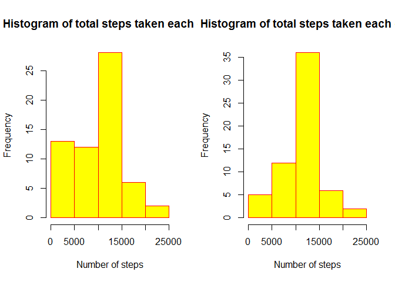
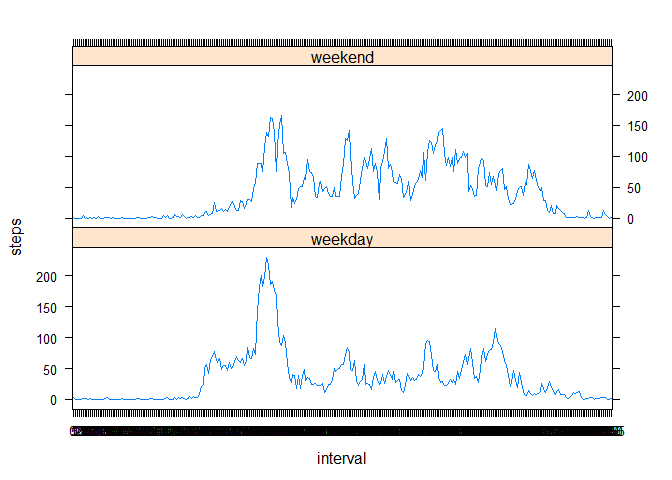

# Reproducible Research: Peer Assessment 1


## Loading and preprocessing the data

After cloning the repository from github and setting the working directory of RStudio to the "RepData_PeerAssessment1" folder, the following code can be used to load the data into R from the cloned repository. If the data is not part of the repository, *download.file()* can be used in accordance with the appropriate url.


```r
unzip_data <- unzip('activity.zip')
activity_data <- read.csv(unzip_data, stringsAsFactors = F)
```

The summary of the dataset can be seen below. 

```r
str(activity_data)
```

```
## 'data.frame':	17568 obs. of  3 variables:
##  $ steps   : int  NA NA NA NA NA NA NA NA NA NA ...
##  $ date    : chr  "2012-10-01" "2012-10-01" "2012-10-01" "2012-10-01" ...
##  $ interval: int  0 5 10 15 20 25 30 35 40 45 ...
```

We can format the date column of the dataset appropriately with the following code. 

```r
activity_data$date <- as.Date(activity_data$date)
```


## What is mean total number of steps taken per day?

1. Total number of steps taken per day (*nsteps*)
2. Make a histogram of *nsteps* for each day.
3. Report the mean and median for *nsteps* per day.


```r
nsteps <- aggregate(activity_data$steps,list(date=activity_data$date),sum, na.rm=TRUE)
colnames(nsteps) <- c('date','totalsteps')
hist(nsteps$totalsteps, 
     xlab='Number of steps', 
     main='Histogram of total steps taken each day',
     col = 'blue',
     border = 'red'
     )
```

 

The mean and median can be calculated simply by calling the appropriate functions.


```r
mean_steps <- mean(nsteps$totalsteps)
median_steps <- median(nsteps$totalsteps)
```

- Mean of total number of steps taken per day: **9354.2295082**
- Median of total number of steps taken per day: **10395**


## What is the average daily activity pattern?

For this part of the question we have to first split the activity dataset by the interval for all the days in the dataset and then calculate their average. 


```r
activity_data$interval <- as.factor(activity_data$interval)
average_steps <- tapply(activity_data$steps, activity_data$interval, mean, na.rm=T, simplify = TRUE)
plot(x=levels(activity_data$interval), y= average_steps, 
     type = 'l', 
     xlab = "Intervals", ylab = "Average number of steps", 
     main = "Average number of steps \n taken in every 5-min interval across all the days"
     )
```

 

To find the interval for which the average of the steps taken across all days is maximum, we can use the *which.max()* function on the average_steps array, whose names are marked as intervals.


```r
max_avgsteps_interval <- names(which.max(average_steps))
```
- The max average steps interval is: **835**


## Imputing missing values

In this step, we will use the mean of the interval/day to fill in the missing values for the corresponding period. The total number of missing cases can be computed by:

```r
missing_cases <- sum(is.na(activity_data))
```
Total number of missing cases is: **2304**

Moreover, to classify where these NA values occur, lets check the number of missing cases in each of the individual variables. (steps, date, interval)

```r
missing_steps <- sum(is.na(activity_data$steps))
missing_dates <- sum(is.na(activity_data$date))
missing_intervals <- sum(is.na(activity_data$interval))
```
Number of missing cases in:  

- steps: 2304
- dates: 0
- intervals: 0

From this it is clear that all the missing values exist in the "steps" column of our dataset. Now to impute the missing values using the mean of the intervals in which they occur, we will do the following.

- In the complete dataset, look for NAs and determine which interval the NA value belongs to.
- Replace the missing values with the *average_steps* values for the interval it belongs to.


```r
for (i in 1:length(activity_data$steps)){
        if(is.na(activity_data$steps[i])){
                for(j in 1:length(average_steps)){
                        if(as.character(activity_data$interval[i]) == names(average_steps[j])){
                                activity_data$steps[i] <- average_steps[j]
                        }
                }
        }
}

imputed_data <- activity_data
```

Finally check if we missed any NAs.

```r
sum(is.na(imputed_data$steps))
```

```
## [1] 0
```
We will now make the histogram like before and see if imputing the data produces any significant difference. 

 
 
The mean and median values of the imputed dataset are respectively:

```r
mean_imputed <- mean(imputed_nsteps$totalsteps)
median_imputed <- median(imputed_nsteps$totalsteps)
```
- Mean: 1.0766189\times 10^{4}
- Median: 1.0766189\times 10^{4}

We observe a very little change (10395 -> 10766) in the median value for the original and imputed datasets. However, the mean changes significantly (9354 -> 10766), especially for cases where the total number of steps per day is less than 10000 steps. The distributions also change quite a bit with the mean value increasing a lot more than it is for the original dataset.

## Are there differences in activity patterns between weekdays and weekends?
To make a new factor variable in the imputed dataset that determines the type of day, we will use the **wday()** function from *lubridate* package will be converted to a factor.

```r
library(lubridate)
imputed_data$daytype <- as.factor(ifelse(wday(imputed_data$date,label=T,abbr = F) %in% c("Saturday","Sunday"),"weekend","weekday"))
```
We will calculate the mean for each interval over weekdays and weekends using the *aggregate()* function and perform the plotting using the **lattice** package. 

```r
library(lattice)
# library(ggplot2)
# ggplot(plotting_data, aes(interval, steps)) + 
#     geom_line() + 
#     facet_grid(. ~ daytype) +
#     xlab("5-minute Intervals") + ylab("Average number of steps")
plotting_data <- aggregate(steps ~ interval + daytype, data=imputed_data, mean)
xyplot(steps~interval|factor(daytype), data=plotting_data, type='l', layout=c(1,2),
       panel=function(x,y,...){
              panel.xyplot(x,y,...)
              # panel.text(1,50,"weekday","weekend")
       })
```

 
